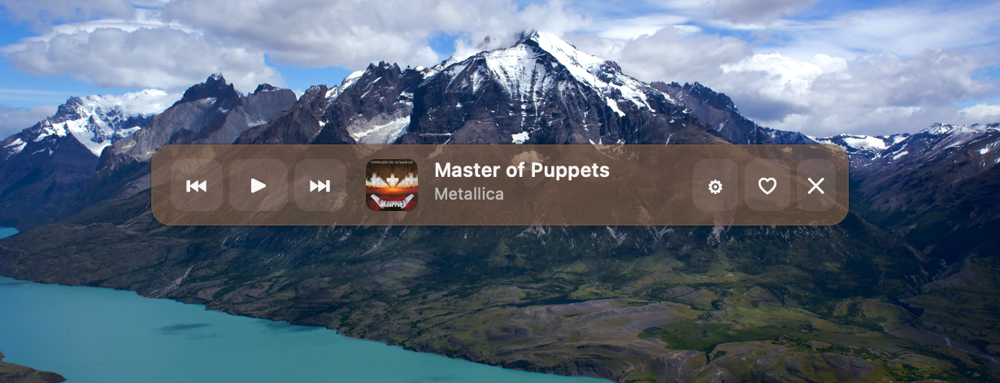
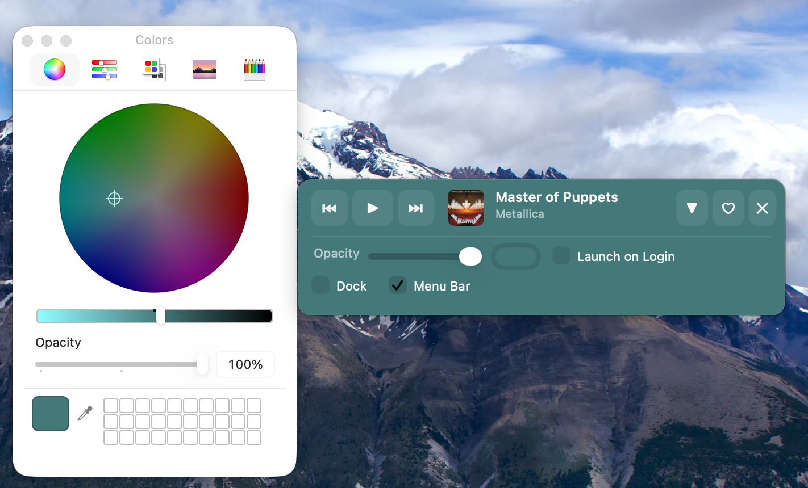

# Nanomuz

A tiny floating music widget for macOS that displays and controls Apple Music playback.





## Features

- Floating widget that stays on top of all windows
- Display current track info (title, artist, artwork)
- Playback controls (play/pause, next, previous)
- Add/remove tracks from favorites
- Scrolling marquee for long titles
- Customizable background color and opacity
- Launch on login option
- Horizontal resizing
- Works on all Spaces
- **Last.fm scrobbling support** — track your listening history

## Requirements

- macOS 12.0 (Monterey) or later
- Apple Music app

## Installation

### Download

Download the latest DMG from [Releases](../../releases).

### Homebrew

```bash
brew tap tsyganov-ivan/nanomuz https://github.com/tsyganov-ivan/nanomuz
brew install --cask nanomuz
```

### Build from source

```bash
git clone https://github.com/tsyganov-ivan/nanomuz.git
cd nanomuz
make install
```

## Usage

1. Open Nanomuz — a floating widget will appear
2. Play music in Apple Music
3. Use the widget to control playback

### Controls

| Button | Action |
|--------|--------|
| ⏮ | Previous track |
| ▶/⏸ | Play/Pause |
| ⏭ | Next track |
| ♡/♥ | Toggle favorite |
| ⚙ | Open settings |
| ✕ | Quit |

### Settings

Click the ⚙ button to expand settings panel:
- **Opacity slider** — adjust background transparency
- **Color picker** — change background color
- **Launch on Login** — start automatically on login
- **Dock** — show/hide app icon in Dock
- **Menu Bar** — show/hide icon in menu bar
- **Always on Top** — keep widget above other windows
- **Scrobble** — enable/disable Last.fm scrobbling
- **Connect Last.fm** — authenticate with your Last.fm account

## Last.fm Scrobbling

Nanomuz supports Last.fm scrobbling to track your listening history.

### How to Connect

1. Open the settings panel (click ⚙)
2. Click **Connect Last.fm**
3. A browser window will open — log in to Last.fm and authorize Nanomuz
4. Return to the app — you're now connected

Or from the menu bar: **Last.fm** → **Connect**

### How It Works

- **Now Playing**: Shows "Listening now" on your Last.fm profile while a track is playing
- **Scrobble**: Records the track to your listening history when you've listened to:
  - 50% of the track duration, or
  - 4 minutes — whichever comes first
  - Tracks under 30 seconds are scrobbled after 4 minutes of play

### Data Collected

When scrobbling is enabled, Nanomuz sends the following data to Last.fm:
- Track title
- Artist name
- Album name (if available)
- Playback timestamp

Your Last.fm session key is securely stored in macOS Keychain.

### Troubleshooting

**Scrobbles not appearing?**
1. Check that scrobbling is enabled (✓ Scrobble in settings)
2. Verify you're connected (menu bar shows "Last.fm: Connected")
3. Make sure you're listening long enough (50% or 4 minutes)
4. Check the log file for errors: menu bar → Show Log File

**Connection failed?**
1. Check your internet connection
2. Try disconnecting and reconnecting
3. Make sure you authorized Nanomuz in the browser

**To disconnect:** Settings → Disconnect, or menu bar → Last.fm → Disconnect

### For Developers

To build with Last.fm support, you need to register for API credentials:

1. Go to [Last.fm API](https://www.last.fm/api/account/create)
2. Create an API account and get your API key and secret
3. Create `.env.local` file in project root:
   ```
   LASTFM_API_KEY=your_api_key_here
   LASTFM_API_SECRET=your_api_secret_here
   ```
4. Build: `make bundle`

The Makefile automatically loads `.env.local` and injects keys at build time.

**Alternative: direnv (auto-loads on cd)**
```bash
brew install direnv
echo 'eval "$(direnv hook zsh)"' >> ~/.zshrc
cp .env.local .envrc
direnv allow
```

### Window

- **Drag** anywhere to move
- **Resize** horizontally by dragging edges

## Configuration

Settings are stored in:
```
~/Library/Application Support/Nanomuz/config.json
```

## Building

```bash
make          # Build app bundle
make dmg      # Create DMG for distribution
make run      # Build and run
make clean    # Clean build artifacts
make icon     # Regenerate app icon
```

## Known Limitations

### Gatekeeper Warning

Since the app is not code-signed or notarized, macOS will show a warning when you first open it.

**To open anyway:**
1. Right-click on `Nanomuz.app`
2. Select "Open"
3. Click "Open" in the dialog

Or via Terminal:
```bash
xattr -d com.apple.quarantine /Applications/Nanomuz.app
```

### Code Signing

For distribution without Gatekeeper warnings, the app needs to be:
1. Signed with an Apple Developer certificate
2. Notarized through Apple's notary service

This requires an [Apple Developer Program](https://developer.apple.com/programs/) membership ($99/year).

## Tech Stack

- Swift 5.9
- AppKit
- MediaRemote.framework (private API via JXA)
- AppleScript for Music.app control
- Last.fm API (scrobbling)

## License

[MIT](LICENSE)

## Contributing

Pull requests are welcome! Please open an issue first to discuss what you would like to change.
